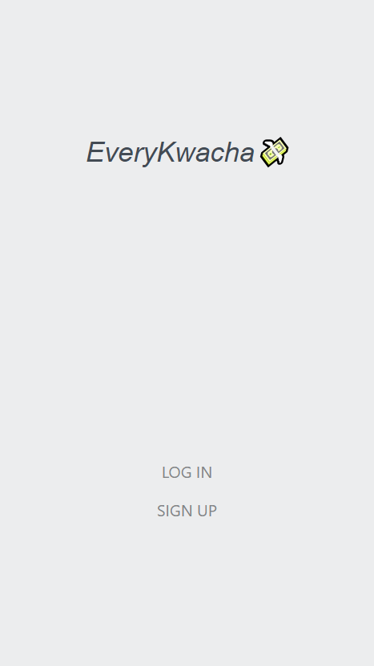
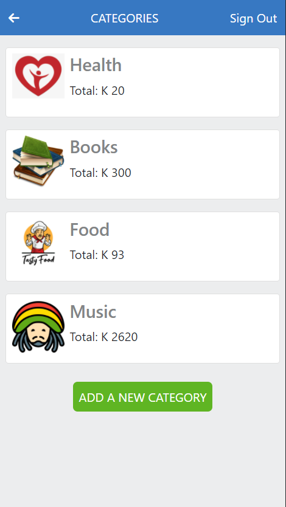
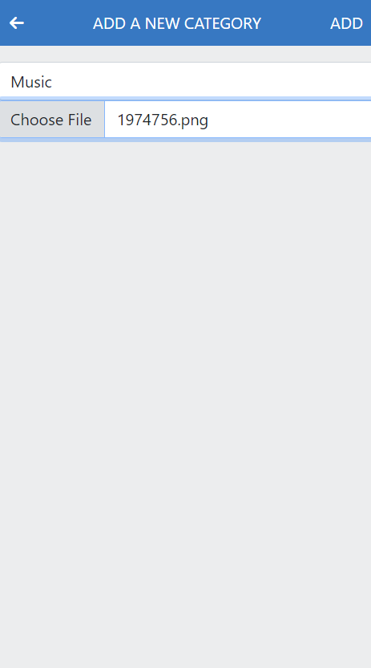
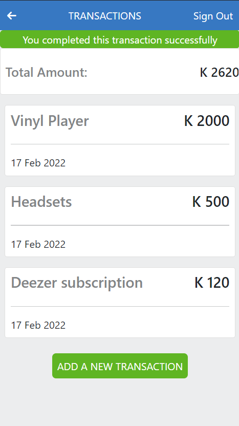
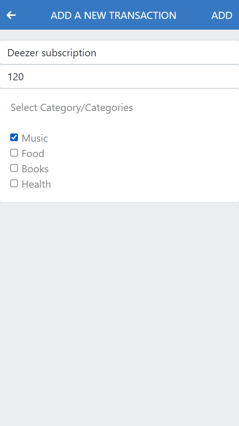

# Every Kwacha App

A mobile web application where you can manage your budget: you have a list of transactions associated with a category, so that you can see how much money you spent and on what.

## Live Version
Here is the [link](https://every-kwacha.herokuapp.com/) to the live version

## Screenshots

> | Splash Page | Login Page |
> |--------------|----------------|
> |||!
> | Home/Categories Page | Add Category Page |
> |||!
> | Transactions Page | Add Transaction Page |
> |||!

## Built With
- Ruby
- Ruby on Rails
- CSS
- Bootstrap
- RSpec
- Capybara

## Setup
- Get the link of the repository: [https://github.com/chaw-bot/every-kwacha](https://github.com/chaw-bot/every-kwacha)
- Clone it as `git@github.com:chaw-bot/every-kwacha.git` on a Terminal
- Usage
- Run bundle install on a Terminal to get Gemfile dependencies.
- Start the server by running `rails s`

## Run test

```bash
$ bundle exec rspec spec
```
  
## Author

👤 **Chawanzi Ng'uni**

- GitHub: [@chaw-bot](https://github.com/chaw-bot)
- Twitter: [@chaw36422087](https://twitter.com/chaw36422087)
- LinkedIn: [Chawanzi Ng'uni](https://www.linkedin.com/in/chawanzi-ng-uni-449328212/)

## 🤝 Contributing

Contributions, issues, and feature requests are welcome!

Feel free to check the [issues page](https://github.com/chaw-bot/every-kwacha/issues).

## Show your support

Give a ⭐️ if you like this project!

## 👏 Acknowledgement 🥇
- This page design was an inspiration from the original design idea by [Gregoire Vella on Behance](https://www.behance.net/gregoirevella).
- Microverse
- Ruby documentation
- Stack Overflow